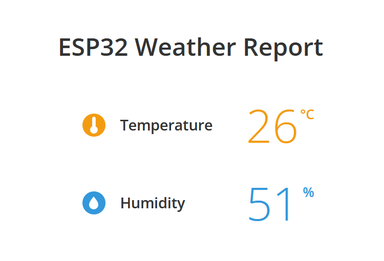

# Temperature and Humidity Sensor using an ESP32

This project uses an esp32doit-devkit-v1 board, a DHT11 temperature and humidity sensor, and a LCD1602 16x2 LCD screen to display the sensor readings for the user.
The board also has a button for toggling between Farenheit and Celsius, and it hosts an internal HTTP server to displaying the readings on a local website.
There is an onboard Potentiometer that can be used to adjust the screen contrast, if you want to use a static resistor instead, I find around 8.2Kohm works best.

This project was developed in the Arduino IDE, and later imported into PlatformIO.

To get started with this project: 

## Hardware Setup

The circuit:
 * USB to ESP32 Dev Board
 * LCD RS pin to digital pin 32
 * LCD Enable pin to digital pin 33
 * LCD D4 pin to digital pin 25
 * LCD D5 pin to digital pin 26
 * LCD D6 pin to digital pin 27
 * LCD D7 pin to digital pin 14
 * LCD R/W pin to ground
 * LCD VSS pin to ground
 * LCD VCC pin to 5V
 * 10K potentiometer:
 * ends to +5V and ground
 * wiper to LCD VO pin (pin 3)
 * DHT11 VCC to 5V
 * DHT11 GND to GND
 * DHT11 DATA to pin 13
 * Button to pin 34 (REQUIRES 3.3V, 5V will not work)
 * 10Kohm pulldown resistor for button to ground

Here is a picture of the physical design on a breadboard. I have a power supply on one end that is only used to jump 5V to both power rails and the same effect can be had using jumper wires.
The Dev board has an onboard voltage regulator that accepts 5V, and has a 3.3V output that you can use to wire up the button. This way you do not have to supply both 5V and 3.3V manually.

Here is a picture of the website. It is made using very basic html, css, and js.

Inside /kicad_files contains the kicad schematic and pcb files. You can reference these for how the pcb is assembled, however the gpio connections in the schematic are not the same
as the connections defined in the code. This is because I changed the gpio pins for easier traces on the PCB design. If you're planning to build on a breadboard, use the pins defined in the code.

## Software Setup
Clone the repository into a working folder of your choosing.
Then open the project with PlatformIO. Verify that it compiles, then upload it to the ESP32 Dev Board.